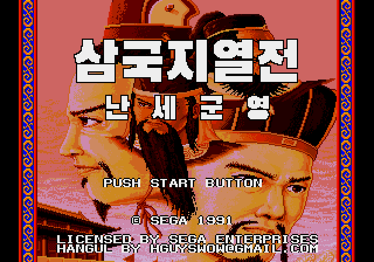
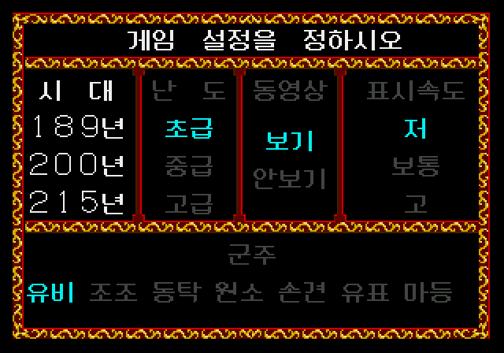
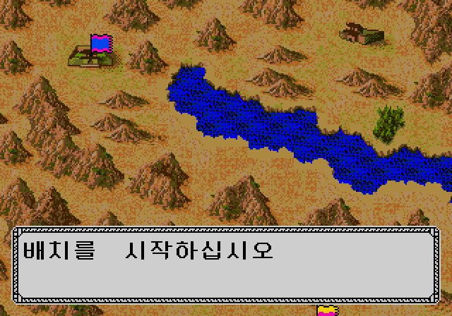
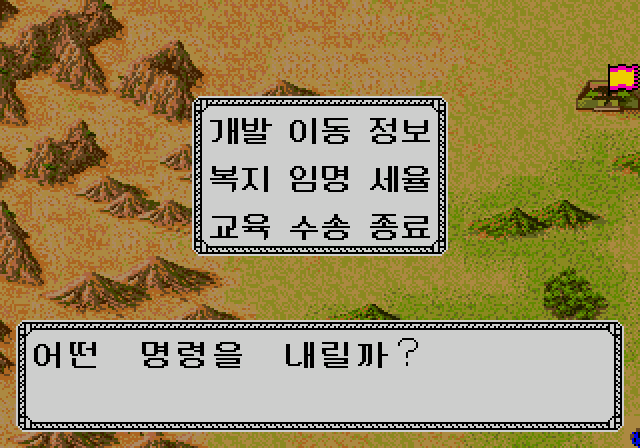
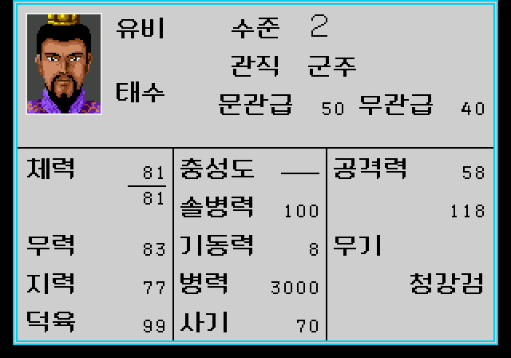
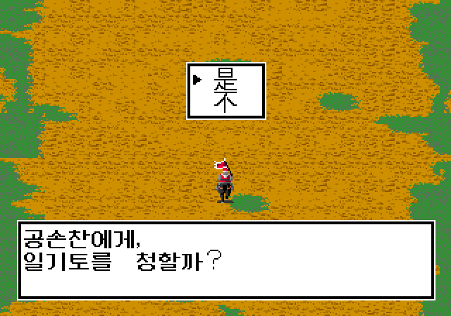

# 삼국지열전 난세군영 (메가드라이브) 한글 패치

메가드라이브 **三國志列傳 亂世群英** (중국어판, *San Guo Zhi Lie Zhuan - Luan Shi Qun Ying (China)*)의 한글 패치입니다.
원작은 세가의 *三國志列伝 乱世の英雄たち*(1991)입니다.

> 이 저장소에는 **IPS 패치 파일만** 있습니다. 게임 ROM은 포함하지 않으며 배포하지 않습니다.
> 원본 ROM은 직접 준비해 주세요.

## 스크린샷

| | |
|---|---|
|  |  |
| 타이틀 로고 | 게임 설정 화면 |
|  |  |
| 지도 화면 메시지 | 내정 명령 메뉴 |
|  |  |
| 무장 상태 화면 | 전투 메시지 |

## 적용 방법

1. 원본 ROM을 준비합니다. 아래 확인값과 같아야 합니다.

   | 항목 | 값 |
   |---|---|
   | 파일 | San Guo Zhi Lie Zhuan - Luan Shi Qun Ying (China).md (또는 .bin/.gen) |
   | 크기 | 1,048,576 바이트 (1MB) |
   | CRC32 | `3B5CC398` |
   | SHA1 | `7AAA0CC1DAFAA14E6D62D6C1DBD462E69617BF7E` |

2. [Lunar IPS](https://www.romhacking.net/utilities/240/) 같은 IPS 패치 도구로
   `sangokushi-retsuden-md-kr.ips` 를 원본 ROM에 적용합니다.
3. 패치된 ROM(2MB)을 에뮬레이터(Kega Fusion, Genesis Plus GX, BlastEm, MAME 등)로 실행합니다.

   | 패치 후 | 값 |
   |---|---|
   | 크기 | 2,097,152 바이트 (2MB) |
   | CRC32 | `978EA674` |
   | SHA1 | `99E5C549974AB01F76F529B762EE5E27BE271851` |

## 한글화 내용

- 타이틀 로고: 삼국지열전 / 난세군영
- 게임 설정 화면, 메뉴, 명령(내정·외교·군비), 무장 상태 화면
- 무장 이름 256명, 도시·관직·무기 이름
- 게임 진행 메시지, 전투·일기토 대사, 군주 소개, 서문, 엔딩 메시지
- 전투 화면: 부대 편성(사병총수·소대병수·궁병대·보병 등), 전투 속도(보통/고), 전투 날짜(제N일)

## 변경 내역

- **2026-10-08**
  - 남아 있던 중국어 그림 글자 한글화: 부대 편성 창, 전투 속도 선택, 전투 날짜 표시
  - 예/아니오 선택지를 **Y / N** 으로 변경 (사용자 요청 반영, 선택 칸이 한 글자 크기라 "아니요"는 들어가지 않음)
  - 빠져 있던 전투 대사 2줄 번역, 일기토 능력치 표시(체/무) 수정
- **2026-10-07** 첫 배포

## 크레딧

- 한글화: hguyswow@gmail.com
- 한글 서체: [Neo둥근모](https://github.com/neodgm/neodgm), 타이틀 로고 [검은고딕(Black Han Sans)](https://github.com/zesstype/Black-Han-Sans) — 모두 SIL Open Font License

## 후원 ☕

이 한글 패치는 무료로 배포됩니다. 재미있게 즐기셨다면 커피 한 잔 값이라도 후원해 주세요.
보내주신 후원은 더 좋은 게임 한글화와 프로그램을 만들어 배포하는 데 큰 힘이 됩니다. 감사합니다!

- 국민은행 `027210862460` (예금주: 강*호)
- PayPal: `hguyswow`

---

이 패치는 비공식 팬 번역이며 세가 및 원 저작권자와 관련이 없습니다.
